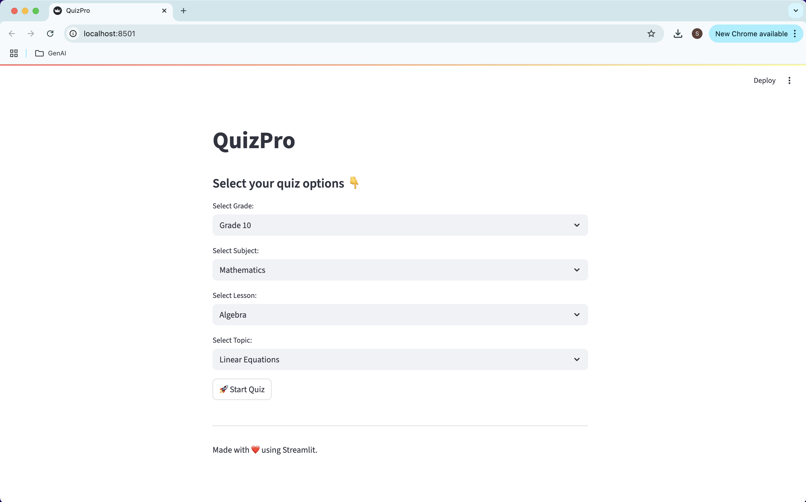
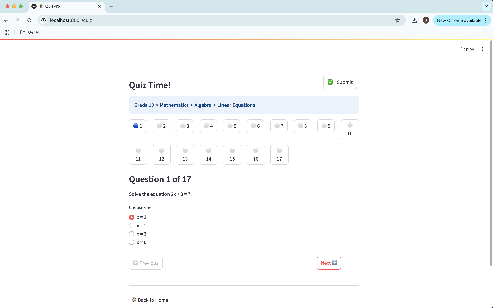
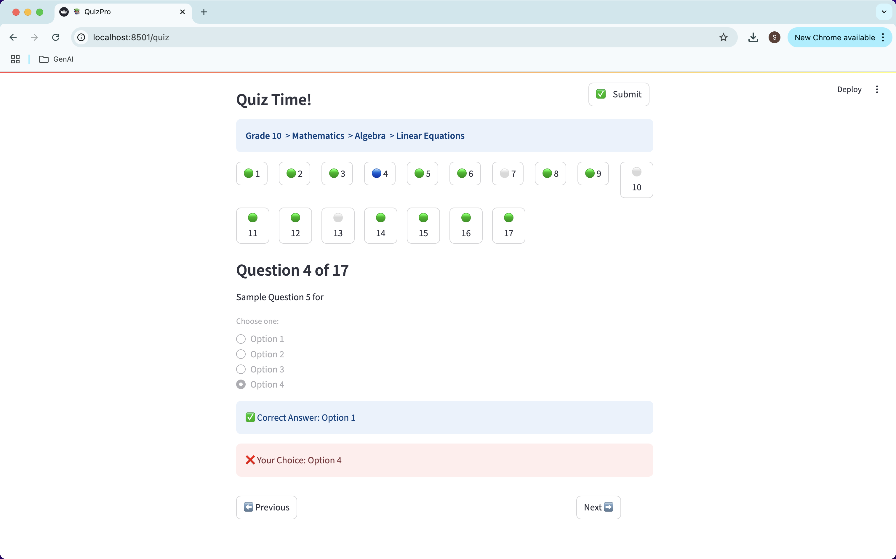
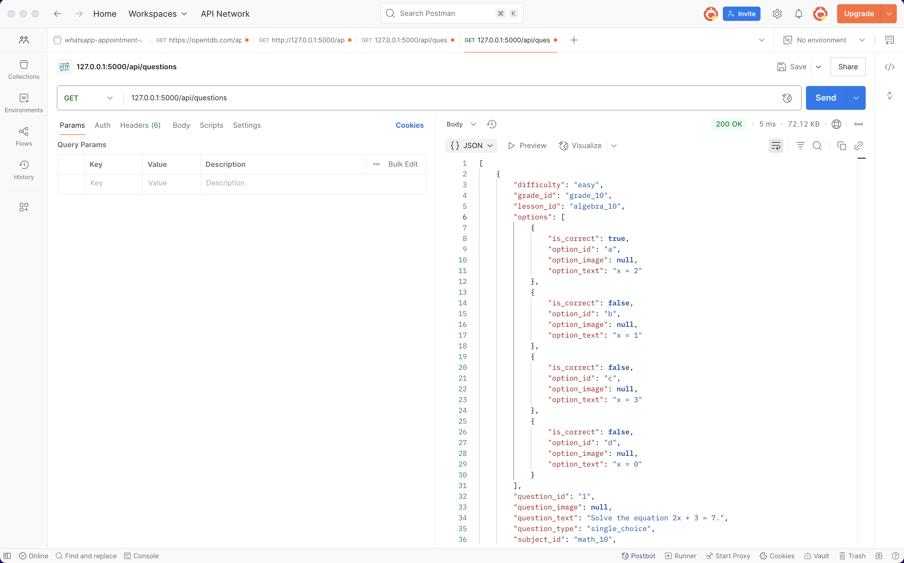

# 📚 QuizPro — Streamlit Quiz Web App

A simple, interactive mathematics quiz web application built with **Streamlit** for the front-end and **Flask** for exposing quiz questions via REST APIs.  
Supports single-choice, multiple-choice, and text-entry questions with clean inline answer reviews and scoring.

---

## ✨ Features

✅ Choose Grade, Subject, Lesson, and Topic  
✅ Single choice, multiple choice, and text-entry question types  
✅ Direct question number navigation with icons  
✅ Submit quiz and review your answers inline with ✅ / ❌ indicators  
✅ Responsive, clean UI with breadcrumb navigation  
✅ REST API backend using Flask (optional)  
✅ No user login / registration for MVP  

---

## 📸 Screenshots

**📊 Main Quiz Selection Page**  


**📖 Quiz Question Page**  


**✅ Quiz Submitted View**  


**📖 Flask API**  


---

## 📦 Project Structure

```
quiz_app/
├── app/
│   ├── api/                 # Flask API exposing questions
│   ├── data/                # JSON data files (questions, metadata)
│   ├── streamlit_app/       # Streamlit pages (main.py, quiz.py)
│   └── utils/               # Python utilities (data_loader.py)
├── img/                     # App screenshots for README
└── README.md
```

---

## ⚙️ Getting Started

### 📦 Install dependencies

```bash
pip install -r requirements.txt
```

### 📦 Run the Flask API (optional)

```bash
cd app/api
python app.py
```

### 📦 Run the Streamlit App

```bash
cd app/streamlit_app
streamlit run main.py
```

---

## 🔧 Configuration

- All data (questions, metadata) resides in `app/data/`
- Quiz session state maintained via `st.session_state`
- Customize the API port in `api/flask_api.py` as needed

---

## 🚀 Roadmap

- Add leaderboard  
- Add timed quizzes  
- Add authentication  
- Export results  
- Support for images in questions and options  

---

## 📜 License

MIT License.  
Feel free to fork, improve, and contribute!

---

## 📣 Connect

Built by [@siva10x.dev](https://instagram.com/siva10x.dev)  
Happy quizzing!